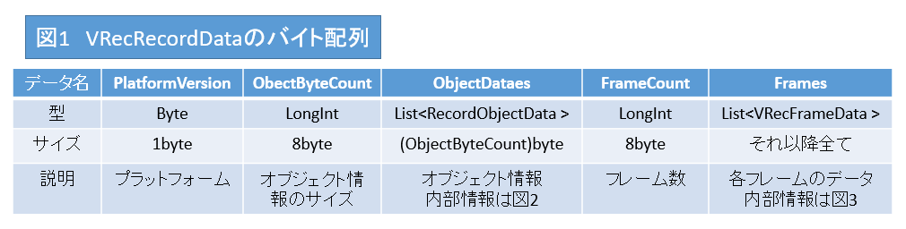
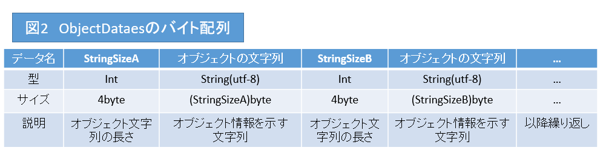
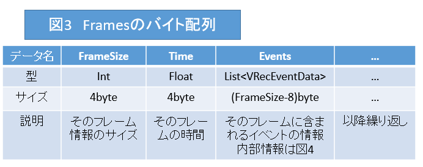
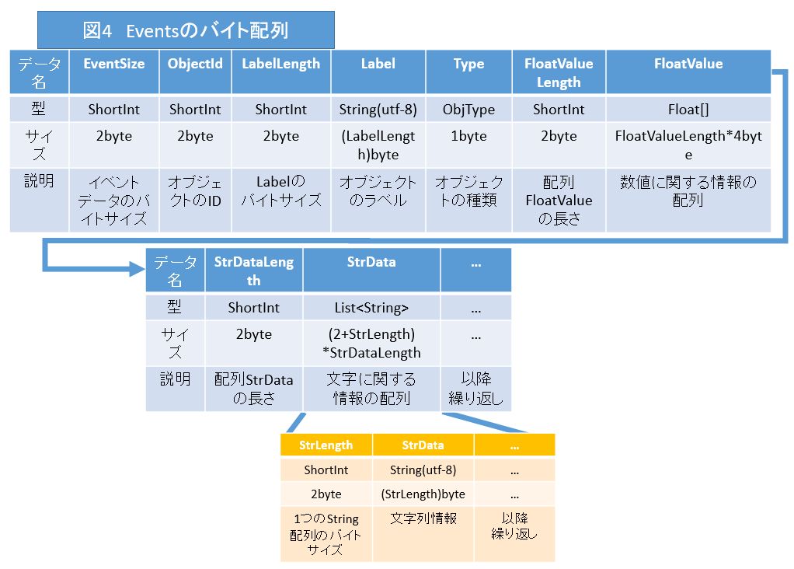

<<[top](VRec.md)
# **VRecRecordData**
namespace:VRec

## **説明**
---
 

本ページでは、
[VRecorderScript](VRecorderScript.md)
と[VViewerScript](VViewerScript.md)で扱う記録・再生データであるVRecRecordDataについてと、それをバイト配列に変換した拡張子「.vrc」について解説します。

## **VRecRecordDataについて**
---

VRecRecordDataは、VRecFrameDataのリストを持つクラスです。

データを削減するメソッドであるGetReducedDataと、Byteとの相互変換を行うToByte,FromByteメソッドを実装しています。

Serializabledを設定しているため、UnityのJsonUtilityで変換可能ですが、JsonUtilityは文字列の大きさに上限(1.5GB)があるため注意してください。

### **プロパティ**
---
|名前|型|解説|
|:--|:--|:--|
|Platform|PlatformVersion|プラットフォームの種類、座標系を示す列挙型。詳しくは[PlatformVersion](#PlatformVersion)|
|Records|List<[VRecFrameData](#VRecFrameData)>|フレームごとのイベントの集合であるVRecFrameDataのリスト。つまり対象の全データ|
|ObjectDataes|List< RecordObjectData>|記録するオブジェクトに関するデータ|
||||

### **メソッド**
---
|名前|戻り値|解説|
|:--|:--|:--|
|GetReducedData|VRecRecordData|各フレームを比較し、前フレームと比較して座標の変わっていないオブジェクトがあればデータを圧縮する。経験的にはおよそ20％程度に圧縮できる|
|FromByte|VRecRecordData|バイト配列を引数としてデータを変換する|
|ToByte|byte[]|自身をバイト配列に変換する|
||||

## PlatformVersion
---
1byteで示されるプラットフォームの座標系を示す値。 

前から3bitがUnity座標系と比較して左右・上下・奥行き方向が逆転しているかどうかを示す。 
0であれば反転しておらず、1であれば反転している。 
後半5bitが単位系を示す。左から順にヤード、フィート、メートル、センチメートル、ミリメートルを示し、1が割り当てられている部分の単位が該当する。

|プラットフォーム|列挙値|bit値|解説|
|:--|:--|:--|:--|
|Unity|4|000 00100|Unity座標系と一致し、長さの単位はメートル|
|UE4|130|100 00010|左右方向のみ反転し、長さの単位はcm|
|||||

ここに記載がないものも、以上の決定規則に従います。

## VRecFrameData
---
VRecFrameDataはあるフレームにおけるVRecEventDataの集合と、それに付随する情報を管理するクラスです。つまり、1フレームの情報を扱います。 
VRecRecordData同様、バイト配列との相互変換を行えます。

#### **プロパティ**
|名前|型|解説|
|:--|:--|:--|
|Events|List<[VRecEventData](#VRecEventData)>|そのフレームに起こるイベントの集合。つまり毎フレームごとのイベント群|
|Displayed|bool|そのフレームが反映されたかどうか|
|Time|float|そのフレームが再生開始から何秒目にあたるかの秒数|
||||

### **メソッド**

|名前|戻り値|解説|
|:--|:--|:--|
|FromByte|VRecFrameData|バイト配列から変換してVRecFrameDataを生成する|
|ToByte|byte[]|VRecFrameDataをバイト配列に変換する|
|

## **VRecEventData**
---
[VRecEventData](VRecEventData.md)を参照してください

## **「.vrc」フォーマットについて**
---

「.vrc」はVRecRecordDataをバイナリファイルとして書きだしたものです。 
全ての変数はビッグエンディアンであることに留意しておいてください。 
以下にそのバイト構造を示します。

